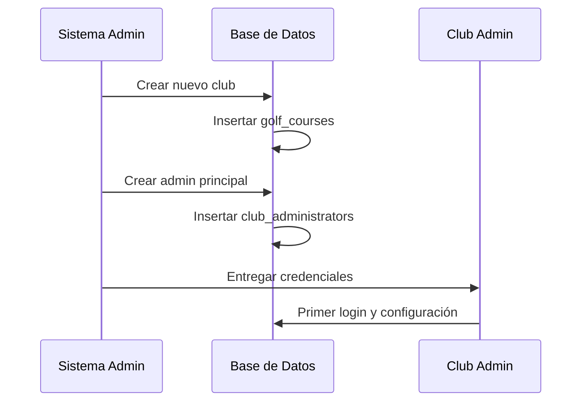
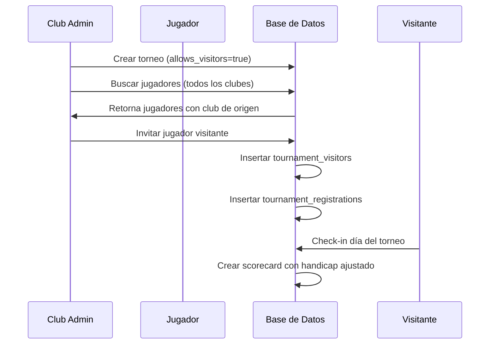
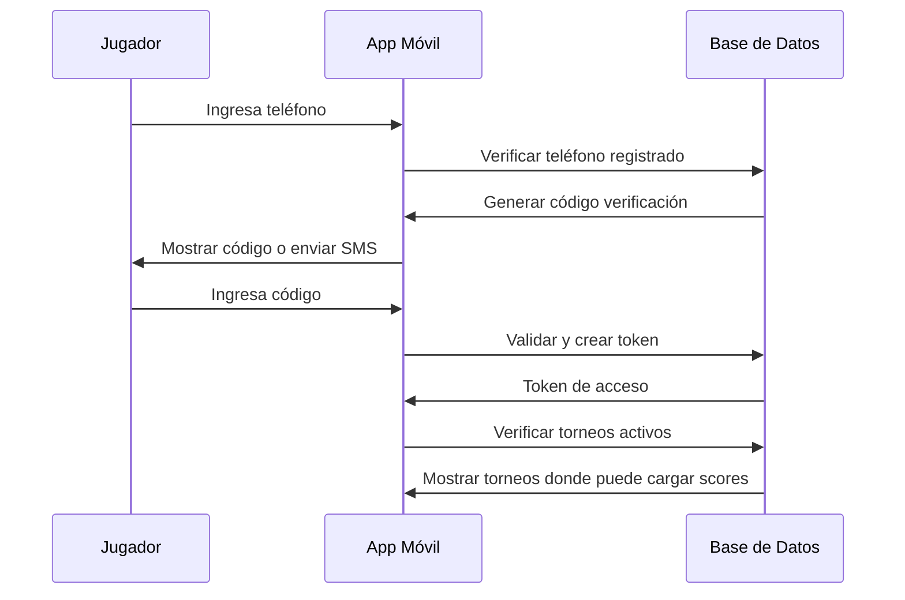

# 🏌️ ARQUITECTURA MULTI-CLUB - SISTEMA DE TORNEOS DE GOLF

## 📋 RESUMEN EJECUTIVO

El sistema ha sido expandido de una arquitectura de club único a una **arquitectura multi-club** con administración jerárquica que permite:

1. **Administrador General del Sistema** - Gestiona todos los clubes
2. **Administradores de Clubes** - Gestionan su club específico independientemente
3. **Usuarios Internos** - Diferentes roles dentro de cada club
4. **Jugadores Compartidos** - Los jugadores pueden estar en múltiples clubes
5. **Torneos Inter-Clubes** - Los clubes pueden invitar jugadores de otros clubes
6. **Historial Centralizado** - Cada jugador tiene acceso a su historial completo

---

## 🏗️ ESTRUCTURA JERÁRQUICA

```
🔧 ADMINISTRADOR GENERAL DEL SISTEMA
├── 📋 Gestión de Clubes (crear, activar, desactivar)
├── 👥 Crear Administradores de Clubes
├── 📊 Monitoreo General del Sistema
└── 💳 Gestión de Suscripciones

    🏌️ CLUB A                    🏌️ CLUB B                    🏌️ CLUB C
    ├── 👤 Admin Principal        ├── 👤 Admin Principal        ├── 👤 Admin Principal
    ├── 👥 Usuarios Internos      ├── 👥 Usuarios Internos      ├── 👥 Usuarios Internos
    ├── 🏌️ Socios del Club       ├── 🏌️ Socios del Club       ├── 🏌️ Socios del Club
    └── 🏆 Torneos del Club       └── 🏆 Torneos del Club       └── 🏆 Torneos del Club

                    📊 DATOS COMPARTIDOS ENTRE CLUBES
                    ├── Nombre y Apellido de Jugadores
                    ├── Handicap Index por Club
                    ├── Historial de Torneos
                    └── Información de Contacto
```

---

## 🆕 NUEVAS TABLAS Y FUNCIONALIDADES

### 1. **ADMINISTRACIÓN DEL SISTEMA**

#### `system_administrators`
- **Propósito**: Administradores generales que gestionan todo el sistema
- **Permisos**: Crear clubes, gestionar suscripciones, crear admins de clubes
- **Acceso**: Nivel más alto del sistema

#### `club_administrators`
- **Propósito**: Administradores específicos de cada club
- **Permisos**: Gestión completa de su club, crear usuarios internos
- **Scope**: Solo su club asignado

#### `club_users`
- **Propósito**: Usuarios internos con diferentes roles y permisos
- **Roles**: `manager`, `tournament_admin`, `scorekeeper`, `viewer`
- **Scope**: Solo su club asignado

### 2. **GESTIÓN DE MEMBRESÍAS**

#### `club_memberships`
- **Propósito**: Relación many-to-many entre jugadores y clubes
- **Características**:
  - Un jugador puede pertenecer a múltiples clubes
  - Cada club mantiene su propio número de socio
  - Handicap específico por club
  - Club principal (`is_home_club`)

### 3. **SISTEMA DE VISITANTES**

#### `tournament_visitors`
- **Propósito**: Gestión de jugadores visitantes en torneos
- **Funcionalidad**:
  - Registro de visitantes de otros clubes
  - Handicap temporal para el torneo
  - Control de límites de visitantes por torneo

### 4. **ACCESO POR TELÉFONO**

#### `player_phone_access`
- **Propósito**: Permite a jugadores acceder vía teléfono
- **Funcionalidad**:
  - Verificación por SMS (futuro)
  - Tokens de acceso temporales
  - Solo pueden cargar scores si están en torneo activo

### 5. **HISTORIAL DE PARTICIPACIONES**

#### `player_tournament_participation`
- **Propósito**: Historial personal de cada jugador
- **Características**:
  - Separado por club organizador
  - Acceso permanente a sus tarjetas
  - Estadísticas personales

---

## 🔄 FLUJOS DE TRABAJO

### **FLUJO 1: Creación de Nuevo Club**



### **FLUJO 2: Registro de Jugador en Torneo Inter-Club**



### **FLUJO 3: Acceso Móvil de Jugador**



---

## 📊 DATOS COMPARTIDOS VS PRIVADOS

### **DATOS COMPARTIDOS ENTRE CLUBES:**
- ✅ Nombre y Apellido
- ✅ Teléfono de contacto
- ✅ Handicap Index (por club)
- ✅ Historial de participación en torneos
- ✅ Club de origen

### **DATOS PRIVADOS POR CLUB:**
- 🔒 Número de socio
- 🔒 Email (opcional compartir)
- 🔒 Información financiera
- 🔒 Notas internas del club
- 🔒 Configuraciones específicas del club

### **DATOS DE TORNEOS:**
- 🏆 **Organizador**: Solo el club organizador puede modificar
- 👥 **Participantes**: Solo el club organizador ve datos completos
- 📋 **Tarjetas**: Solo el club organizador procesa y valida
- 📊 **Resultados**: Solo el club organizador publica
- 👤 **Historial Personal**: Cada jugador ve su propio historial completo

---

## 🔐 NIVELES DE ACCESO Y PERMISOS

### **NIVEL 1: ADMINISTRADOR GENERAL DEL SISTEMA**
```json
{
  "create_clubs": true,
  "manage_subscriptions": true,
  "create_club_admins": true,
  "deactivate_clubs": true,
  "system_reports": true,
  "backup_management": true
}
```

### **NIVEL 2: ADMINISTRADOR DE CLUB**
```json
{
  "manage_club_settings": true,
  "create_internal_users": true,
  "import_export_members": true,
  "manage_tournaments": true,
  "update_handicaps": true,
  "view_club_reports": true
}
```

### **NIVEL 3: USUARIOS INTERNOS**

#### **Manager**
```json
{
  "manage_tournaments": true,
  "manage_members": true,
  "view_reports": true,
  "process_scores": true
}
```

#### **Tournament Admin**
```json
{
  "create_tournaments": true,
  "manage_groups": true,
  "process_scores": true,
  "generate_results": true
}
```

#### **Scorekeeper**
```json
{
  "process_scores": true,
  "validate_scorecards": true,
  "manage_live_scoring": true
}
```

#### **Viewer**
```json
{
  "view_tournaments": true,
  "view_results": true,
  "view_reports": true
}
```

---

## 📱 ACCESO MÓVIL DE JUGADORES

### **REQUISITOS PARA ACCESO:**
1. ✅ Estar registrado en al menos un club del sistema
2. ✅ Tener teléfono verificado
3. ✅ Estar inscrito en un torneo vigente
4. ✅ El tee time debe estar activo (dentro del horario de salida)

### **FUNCIONALIDADES MÓVILES:**
- 📋 Ver torneos donde está inscrito
- ⏰ Ver horarios de salida
- 🏌️ Cargar golpes en tiempo real
- ✍️ Firmar tarjeta (jugador y marcador)
- 📊 Ver progreso del torneo
- 📱 Descargar tarjeta completada
- 📈 Ver historial personal de torneos

---

## 🔄 MIGRACIÓN DESDE SISTEMA ACTUAL

### **PASOS DE MIGRACIÓN:**

1. **Ejecutar script de migración** (`database_design_multiclub.sql`)
2. **Crear administrador general del sistema**
3. **Convertir clubes existentes** (asignar códigos de club)
4. **Crear administradores de clubes** para clubes existentes
5. **Migrar jugadores a membresías** (crear registros en `club_memberships`)
6. **Actualizar torneos existentes** (asignar `organizing_course_id`)

### **COMPATIBILIDAD:**
- ✅ **100% compatible** con funcionamiento actual
- ✅ **Sin pérdida de datos** existentes
- ✅ **Migración automática** de relaciones
- ✅ **Funcionalidades existentes** siguen funcionando

---

## 📈 BENEFICIOS DEL NUEVO SISTEMA

### **PARA ADMINISTRADORES:**
- 🎯 **Gestión Centralizada**: Un solo sistema para múltiples clubes
- 💰 **Modelo de Suscripción**: Ingresos recurrentes por club
- 📊 **Reportes Consolidados**: Vista general de todos los clubes
- 🔧 **Mantenimiento Simplificado**: Una sola instalación

### **PARA CLUBES:**
- 🏌️ **Independencia Total**: Cada club gestiona sus datos
- 👥 **Intercambio de Jugadores**: Torneos inter-clubes fáciles
- 📱 **Tecnología Moderna**: Sin inversión en desarrollo
- 📊 **Reportes Especializados**: Datos específicos de su club

### **PARA JUGADORES:**
- 🏆 **Historial Unificado**: Un solo lugar para ver todos sus torneos
- 📱 **Acceso Móvil Fácil**: Solo con número de teléfono
- 🏌️ **Jugar en Múltiples Clubes**: Sin re-registrarse
- 📋 **Tarjetas Digitales**: Acceso permanente a sus scorecards

---

## 🚀 PRÓXIMOS PASOS

1. **Implementar interfaces web** para cada nivel de usuario
2. **Desarrollar app móvil** optimizada para jugadores
3. **Integrar sistema de pagos** para suscripciones
4. **Conectar con entes reguladores** para handicaps automáticos
5. **Desarrollar reportes avanzados** y analytics
6. **Implementar notificaciones** push y SMS
7. **Agregar función de invitaciones** automáticas entre clubes

---

## 📞 SOPORTE TÉCNICO

Para implementar esta arquitectura multi-club, el sistema mantiene **total compatibilidad** con el funcionamiento actual mientras agrega las nuevas capacidades multi-club. Los clubes existentes pueden seguir operando normalmente mientras se benefician gradualmente de las nuevas funcionalidades.

La migración es **no-disruptiva** y puede implementarse progresivamente club por club.
